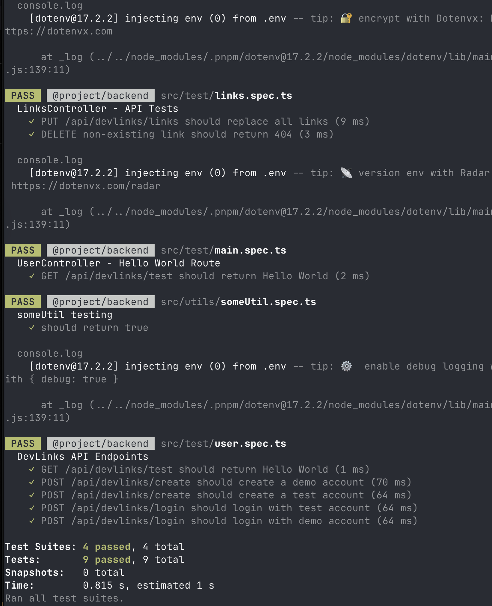
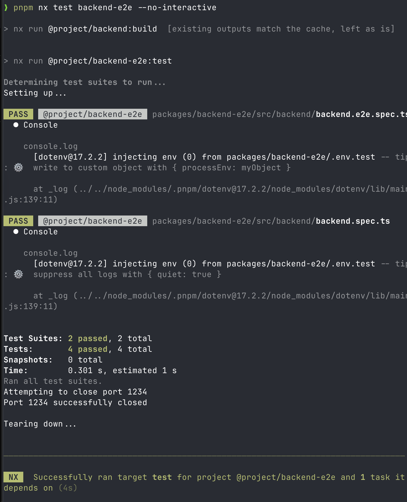
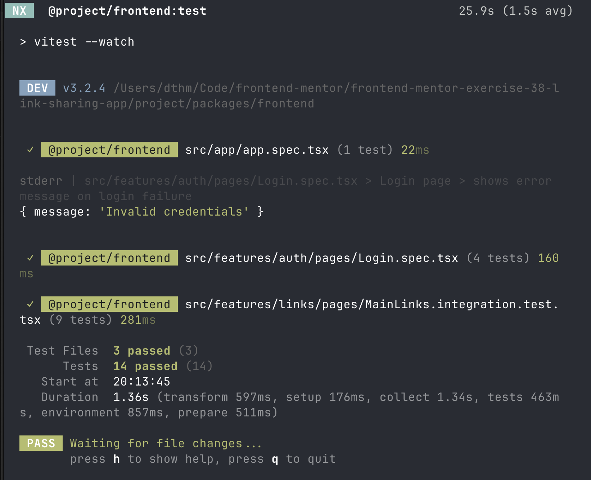
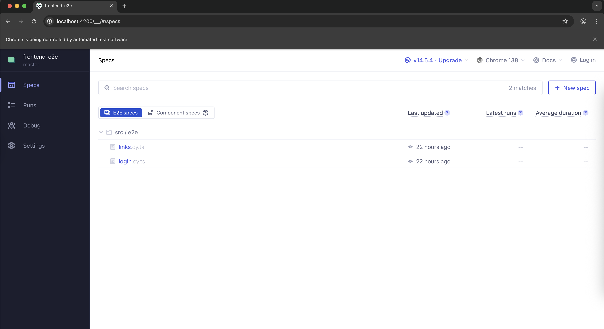
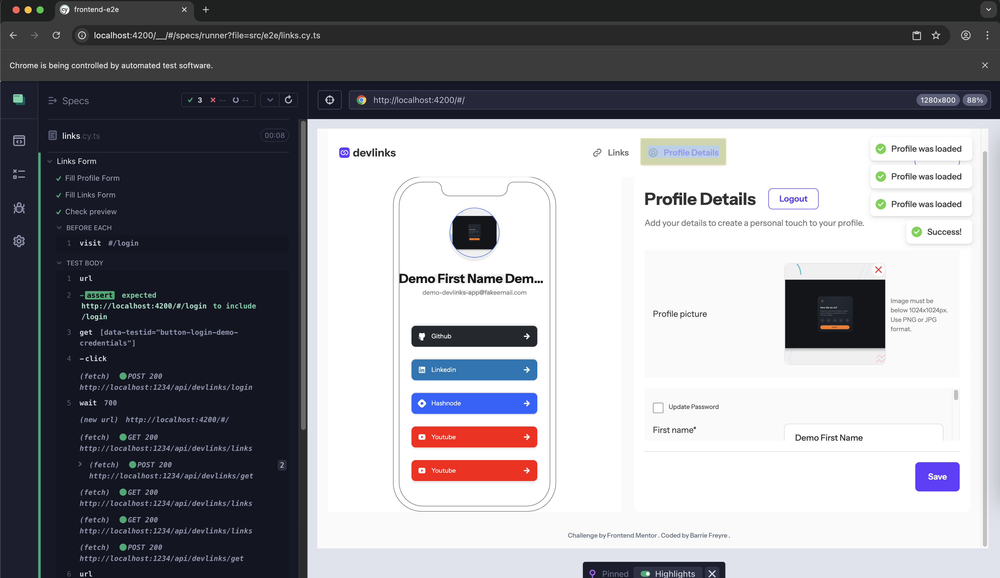

# Frontend Mentor - Link-sharing app


## Code, Url Site and Repository of other challenges

* [Github](https://github.com/barriedirk/frontend-mentor-exercise-38-link-sharing-app)
* [URL Site](https://link-sharing-frontend.onrender.com/#/)
* [Repository Frontend Mentor](https://www.frontendmentor.io/profile/barriedirk)

## Test's Screenshot (unit, integration and end-to-end tests)







## Technologies Used

This project is organized as an Nx monorepo, containing both a frontend and backend application, along with their E2E test suites. It is built with modern TypeScript tooling and focuses on modularity, performance, and developer experience.

## Monorepo & Tooling

* Nx 22 – Monorepo management, build orchestration, caching, and dependency graph.
* pnpm – Fast and space-efficient package manager.
* TypeScript 5.9 – Strongly typed language for both frontend and backend.
* SWC – Fast JavaScript/TypeScript compiler used by Nx and Jest.
* ESLint & Prettier – Code linting and formatting.
* Jest & Vitest – Unit testing frameworks.
* Cypress – End-to-end testing for frontend and backend.


## Frontend (@project/frontend)

* Built with a modern React stack for performance and clean developer experience.
  
### Core Technologies
  
* React 19 with TypeScript
* Vite 7 – Lightning-fast dev server and bundler
* React Router 6 – Client-side routing
* Tailwind CSS 3 – Utility-first CSS framework
* PostCSS & Autoprefixer – CSS processing
* React Refresh – Hot module replacement for rapid feedback
  
### State & Data Management

* Zustand 5 – Lightweight state management
* @tanstack/react-query 5 – Data fetching and caching
* React Hook Form + Zod + @hookform/resolvers – Form validation and schema validation
* @preact/signals-react – Reactive state signals
* React Hot Toast – Notifications and toasts

### Testing

* Testing Library (React, DOM, User Event) – Component and integration testing
* Vitest – Test runner and assertion library

## Backend (@project/backend)

A lightweight and secure REST API built with Express.

### Core Technologies

* Express 4
* TypeScript
* PostgreSQL (via pg and pg-native)
* JWT (jsonwebtoken) – Authentication
* bcryptjs – Password hashing
* multer – File uploads
* Cloudinary – Media storage
* Zod – Input validation
* CORS & dotenv – Security and environment management

### Testing

* Jest + Supertest – Integration and unit testing
* Nx e2e runner – End-to-end backend tests


## End-to-End Testing

* Cypress for frontend UI and interaction testing (frontend-e2e)
* Jest + Supertest for backend E2E API tests (backend-e2e)


## Development Scripts

* pnpm start:all =>	Runs both frontend and backend in development mode concurrently
* pnpm serve:frontend	=> Starts the frontend development server
* pnpm serve:backend	=> Starts the backend development server
* pnpm build:frontend	=> Builds the frontend for production
* pnpm build:backend	=> Builds the backend for production
* pnpm test:frontend	=> Runs frontend unit tests
* pnpm test:backend	=> Runs backend unit tests
* pnpm test:frontend-e2e => Runs frontend Cypress tests
* pnpm test:backend-e2e	=> Runs backend E2E Jest tests

## CI/CD

* Dockerfile & docker-compose.yml – For local development and containerized deployment

## Project Structure

```txt
packages/
├── frontend          # React + Vite + Tailwind app
├── frontend-e2e      # Cypress E2E tests
├── backend           # Express + PostgreSQL API
└── backend-e2e       # Jest E2E tests
```

###  Running in Development

```bash
# Start docker ( database )
docker compose up -d
# docker compose down # turn off

# Start frontend only
pnpm serve:frontend

# Start backend only
pnpm serve:backend

# Or start both concurrently
pnpm start:all

```

